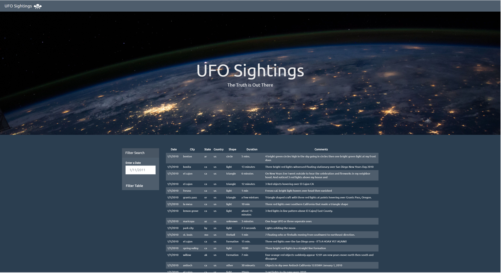
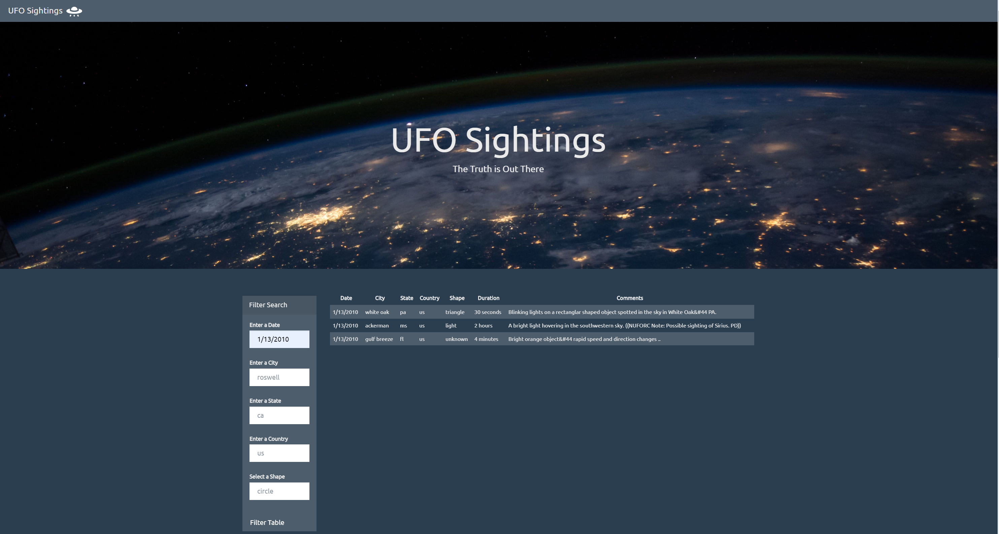

# JavaScript and DOM Manipulation

## About 

 

`ALIENS-R-REAL` have collected all of the eye-witness reports to prove ALIENS ARE REAL! but collection is too large to search through manually. I wrote a code that will create a table dynamically based upon a [Dataset Provided](UFO-level-1/static/js/data.js). It has filter that allows to search for specific values. 

Technology Used:

* HTML/CSS/Javascript
* D3

 

## Install

 

* Clone from Github page.
* In terminal or gitBash, run a git clone in desired location to save app.
* Open the index.html file in each directory (UFO-level-1 and UFO-level-2).

 

## Process

### UFO-1: Automatic Table and Date Search
 

* HTML web page provided.

* Using the UFO dataset provided in the form of an array of JavaScript objects, I wrote a code that appends a table to the web page and then adds new rows of data for each UFO sighting.

* The table has a column for `date/time`, `city`, `state`, `country`, `shape`, and `comment` at the very least.

* The code listens for events and search through the `date/time` column to find rows that match user input.

 

 

### UFO-2: Multiple Search Categories
 

* Using multiple `input` tags and/or select dropdowns, the code can set multiple filters and search for UFO sightings using the following criteria based on the table columns:

  1. `date/time`
  2. `city`
  3. `state`
  4. `country`
  5. `shape`

 

 

